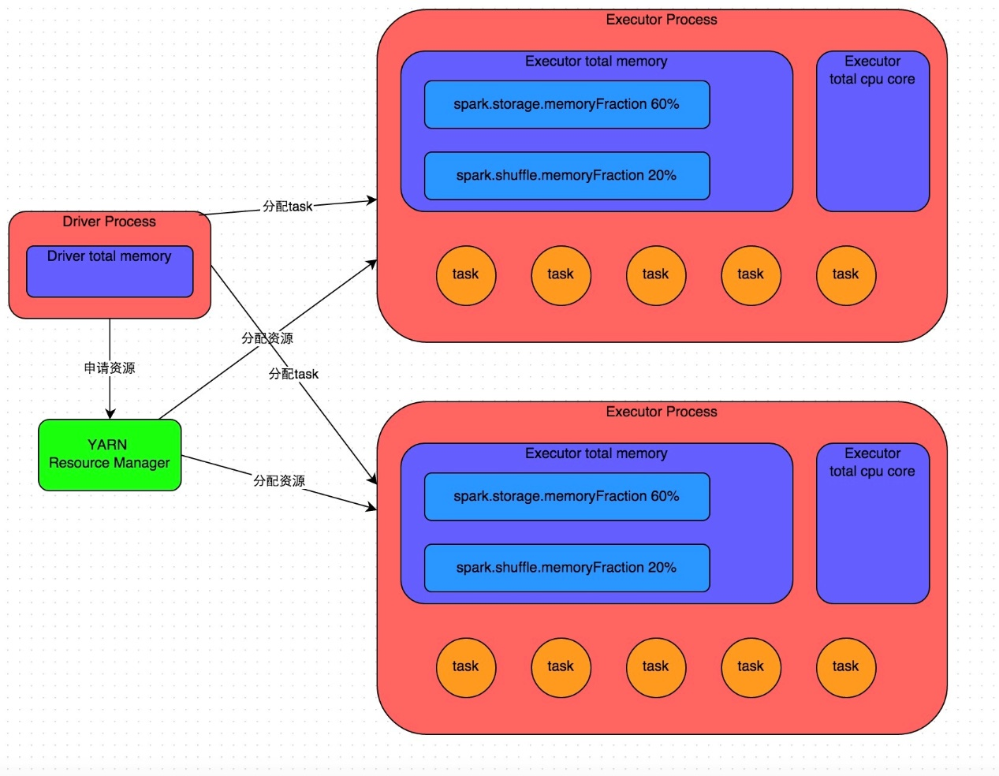
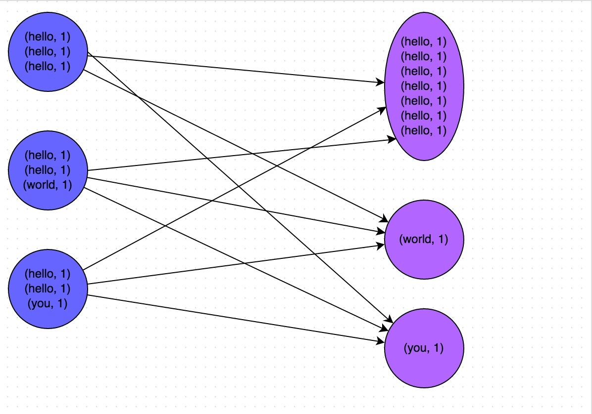
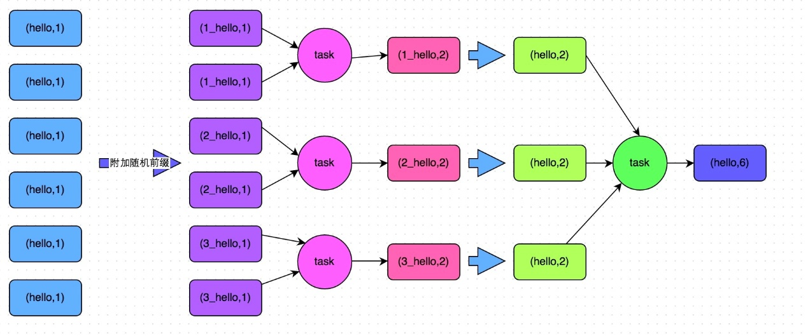
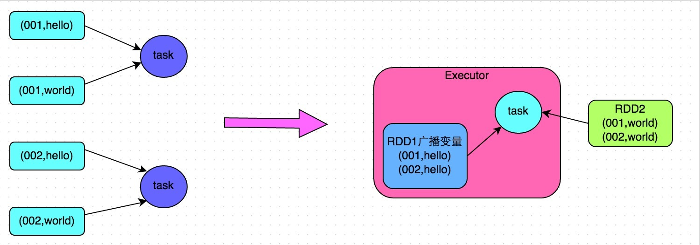
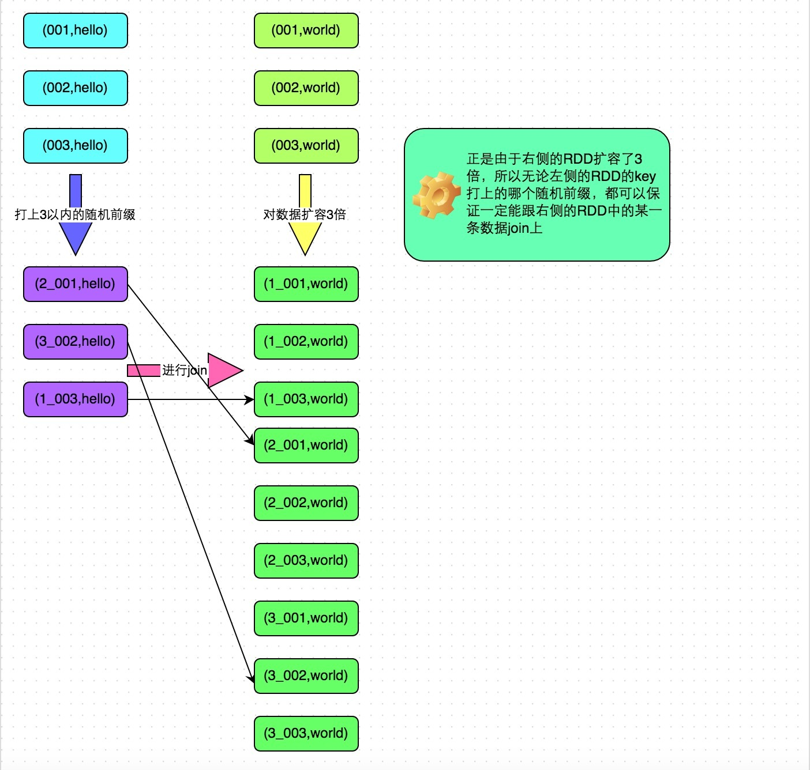

**Spark调优思路**

-   [目录](#目录)

- [0.优化点](#0优化点)
  * [1、增加硬件资源](#1增加硬件资源)
  
  * [2、充分利用资源](#2充分利用资源)
  
  * [3、减化计算](#3减化计算)
  
  * [4、减少网络传输](#4减少网络传输)
  
  * [5、优化等待时间](#5优化等待时间)
  
  * [6、减少GC](#6减少gc)

-   [1.开发调优](#1开发调优)

  * [1.1避免创建重复的RDD](#11避免创建重复的rdd)

  * [1.2尽量重用同一个RDD](#12尽量重用同一个rdd)

  * [1.3对多次使用的RDD进行持久化](#13对多次使用的rdd进行持久化)

  * [1.4尽量避免使用shuffle类算子](#14尽量避免使用shuffle类算子)

  * [1.5使用map-side预聚合的算子进行shuffle操作](#15使用map-side预聚合的算子进行shuffle操作)

  * [1.6使用高性能的算子](#16使用高性能的算子)

  * [1.7广播大变量broadcast](#17广播大变量broadcast)

  * [1.8使用Kryo优化序列化性能](#18使用kryo优化序列化性能)

  * [1.9优化数据结构](#19优化数据结构)

  * [1.10使用fastutil的类集代替java的类集](#110使用fastutil的类集代替java的类集)

  * [1.11设置数据调度等待时间](#111设置数据调度等待时间)

  * [1.12RDD partitionby](#112rdd-partitionby)

  * [1.13join时分区方式](#113join时分区方式)

-   [2.资源调优](#2资源调优)

  * [2.1num-executors](#21num-executors)

  * [2.2executor-memory](#22executor-memory)

  * [2.3executor-cores](#23executor-cores)

  * [2.4driver-memory](#24driver-memory)

  * [2.5spark.default.parallelism](#25sparkdefaultparallelism)

  * [2.6spark.storage.memoryfraction](#26sparkstoragememoryfraction)

  * [2.7spark.shuffle.memoryfraction](#27sparkshufflememoryfraction)

    -   [JVM调优：降低RDD的cache操作的内存占比](#jvm调优-降低rdd的cache操作的内存占比)

    -   [1、先介绍JVM的内存机制](#1先介绍jvm的内存机制)

    -   [2、调优方式](#2调优方式)

  * [2.8JVM调优：堆外内存溢出](#28jvm调优-堆外内存溢出)

  * [2.9spark.cores.max 21](#29sparkcoresmax-21)

    -   [示例](#示例)

-   [3.数据倾斜调优](#3数据倾斜调优)

  * [3.1数据倾斜的原理](#31数据倾斜的原理)

  * [3.2如何定位导致数据倾斜的代码](#32如何定位导致数据倾斜的代码)

  * [3.3数据倾斜的解决方案](#33数据倾斜的解决方案)

    -   [解决方案一：使用Hive ETL预处理数据](#解决方案一-使用hive-etl预处理数据)

    -   [解决方案二：过滤少数导致倾斜的key](#解决方案二-过滤少数导致倾斜的key)

    -   [解决方案三：提高shuffle操作的并行度](#解决方案三-提高shuffle操作的并行度)

    -   [解决方案四：两阶段聚合（局部聚合+全局聚合）](#解决方案四)

    -   [解决方案五：将reduce join转为map
        join](#解决方案五-将reduce-join转为map-join)

    -   [解决方案六：采样倾斜key并分拆join操作](#解决方案六-采样倾斜key并分拆join操作)

    -   [解决方案七：使用随机前缀和扩容RDD进行join](#解决方案七-使用随机前缀和扩容rdd进行join)

    -   [解决方案八：多种方案组合使用](#解决方案八-多种方案组合使用)

-   [4.shuffle调优](#4shuffle调优)

  * [4.1spark.shuffle.file.buffer](#41sparkshufflefilebuffer)

  * [4.2spark.reducer.maxSizeInFlight](#42sparkreducermaxsizeinflight)

  * [4.3spark.shuffle.io.maxRetries](#43sparkshuffleiomaxretries)

  * [4.4spark.shuffle.io.retryWait](#44sparkshuffleioretrywait)

  * [4.5spark.shuffle.memoryFraction](#45sparkshufflememoryfraction)

  * [4.6spark.shuffle.manager](#46sparkshufflemanager)

  * [4.7spark.shuffle.sort.bypassMergeThreshold](#47sparkshufflesortbypassmergethreshold)

  * [4.8spark.shuffle.consolidateFiles](#48sparkshuffleconsolidatefiles)

0.优化点
========

1、增加硬件资源
---------------

2、充分利用资源
---------------

1、spark-submit时设置

2、设置task数量

3、减化计算
-----------

1、持久化RDD

2、使用fastutil类集

4、减少网络传输
---------------

1、广播变量

2、kryo序列化

3、shuffle的map端调优

5、优化等待时间
---------------

1、调节数据调度等待时间

6、减少GC
---------

1、堆内存调优

2、堆外内存调优

3、kryo序列化

4、广播变量

开发调优
========

1.1避免创建重复的RDD
--------------------

//
需要对名为“hello.txt”的HDFS文件进行一次map操作，再进行一次reduce操作。也就是说，需要对一份数据执行两次算子操作。

// 错误的做法：对于同一份数据执行多次算子操作时，创建多个RDD。

//
这里执行了两次textFile方法，针对同一个HDFS文件，创建了两个RDD出来，然后分别对每个RDD都执行了一个算子操作。

//
这种情况下，Spark需要从HDFS上两次加载hello.txt文件的内容，并创建两个单独的RDD；第二次加载HDFS文件以及创建RDD的性能开销，很明显是白白浪费掉的。

val rdd1 = sc.textFile("hdfs://192.168.0.1:9000/hello.txt")

rdd1.map(...)

val rdd2 = sc.textFile("hdfs://192.168.0.1:9000/hello.txt")

rdd2.reduce(...)

// 正确的用法：对于一份数据执行多次算子操作时，只使用一个RDD。

//
这种写法很明显比上一种写法要好多了，因为我们对于同一份数据只创建了一个RDD，然后对这一个RDD执行了多次算子操作。

//
但是要注意到这里为止优化还没有结束，由于rdd1被执行了两次算子操作，第二次执行reduce操作的时候，还会再次从源头处重新计算一次rdd1的数据，因此还是会有重复计算的性能开销。

//
要彻底解决这个问题，必须结合“原则三：对多次使用的RDD进行持久化”，才能保证一个RDD被多次使用时只被计算一次。

val rdd1 = sc.textFile("hdfs://192.168.0.1:9000/hello.txt")

rdd1.map(...)

rdd1.reduce(...)

1.2尽量重用同一个RDD
--------------------

// 错误的做法。

// 有一个\<Long, String\>格式的RDD，即rdd1。

//
接着由于业务需要，对rdd1执行了一个map操作，创建了一个rdd2，而rdd2中的数据仅仅是rdd1中的value值而已，也就是说，rdd2是rdd1的子集。

JavaPairRDD\<Long, String\> rdd1 = ...

JavaRDD\<String\> rdd2 = rdd1.map(...)

// 分别对rdd1和rdd2执行了不同的算子操作。

rdd1.reduceByKey(...)

rdd2.map(...)

// 正确的做法。

//
上面这个case中，其实rdd1和rdd2的区别无非就是数据格式不同而已，rdd2的数据完全就是rdd1的子集而已，却创建了两个rdd，并对两个rdd都执行了一次算子操作。

//
此时会因为对rdd1执行map算子来创建rdd2，而多执行一次算子操作，进而增加性能开销。

// 其实在这种情况下完全可以复用同一个RDD。

// 我们可以使用rdd1，既做reduceByKey操作，也做map操作。

//
在进行第二个map操作时，只使用每个数据的tuple._2，也就是rdd1中的value值，即可。

JavaPairRDD\<Long, String\> rdd1 = ...

rdd1.reduceByKey(...)

rdd1.map(tuple._2...)

// 第二种方式相较于第一种方式而言，很明显减少了一次rdd2的计算开销。

//
但是到这里为止，优化还没有结束，对rdd1我们还是执行了两次算子操作，rdd1实际上还是会被计算两次。

//
因此还需要配合“原则三：对多次使用的RDD进行持久化”进行使用，才能保证一个RDD被多次使用时只被计算一次。

1.3对多次使用的RDD进行持久化
----------------------------

Spark中对于一个RDD执行多次算子的默认原理是这样的：每次你对一个RDD执行一个算子操作时，都会重新从源头处计算一遍，计算出那个RDD来，然后再对这个RDD执行你的算子操作。这种方式的性能是很差的。

因此对于这种情况，我们的建议是：对多次使用的RDD进行持久化。此时Spark就会根据你的持久化策略，将RDD中的数据保存到内存或者磁盘中。以后每次对这个RDD进行算子操作时，都会直接从内存或磁盘中提取持久化的RDD数据，然后执行算子，而不会从源头处重新计算一遍这个RDD，再执行算子操作。

如何选择一种最合适的持久化策略？

1.  MEMORY \_ONLY

2.  MEMORY \_ONLY_SER

3.  MEMORY_AND_DISK_SER

4.  不建议使用DISK_ONLY和后缀为_2的级别

SER级别会将RDD中的数据进行序列化，RDD的每个partition会被序列化成一个字节数组。这种方式更加节省内存，从而可以避免持久化的数据占用过多内存导致频繁GC。

1.4尽量避免使用shuffle类算子
----------------------------

因为Spark作业运行过程中，最消耗性能的地方就是shuffle过程。shuffle过程，简单来说，就是将分布在集群中多个节点上的同一个key，拉取到同一个节点上，进行聚合或join等操作。比如reduceByKey、join等算子，都会触发shuffle操作。

shuffle过程中，各个节点上的相同key都会先写入本地磁盘文件中，然后其他节点需要通过网络传输拉取各个节点上的磁盘文件中的相同key。而且相同key都拉取到同一个节点进行聚合操作时，还有可能会因为一个节点上处理的key过多，导致内存不够存放，进而溢写到磁盘文件中。因此在shuffle过程中，可能会发生大量的磁盘文件读写的IO操作，以及数据的网络传输操作。磁盘IO和网络数据传输也是shuffle性能较差的主要原因。

因此在我们的开发过程中，能避免则尽可能避免使用reduceByKey、join、distinct、repartition等会进行shuffle的算子，尽量使用map类的非shuffle算子。这样的话，没有shuffle操作或者仅有较少shuffle操作的Spark作业，可以大大减少性能开销。

1.5使用map-side预聚合的算子进行shuffle操作
------------------------------------------

例如，建议使用reduceByKey或者aggregateByKey算子来替代掉groupByKey算子。

1.6使用高性能的算子
-------------------

map---------\>mapPartition

foreach---------\>foreachPartition

使用filter之后进行coalesce操作

使用repartitionAndSortWithinPartitions替代repartition与sort类操作

repartitionAndSortWithinPartitions是Spark官网推荐的一个算子，官方建议，如果需要在repartition重分区之后，还要进行排序，建议直接使用repartitionAndSortWithinPartitions算子。因为该算子可以一边进行重分区的shuffle操作，一边进行排序。shuffle与sort两个操作同时进行，比先shuffle再sort来说，性能可能是要高的。

1.7广播大变量broadcast
----------------------

对与算子（如map，flatmap等）中用到的大的公共变量，在默认情况下会在每个task中复制一份，所以
要把这样的公共变量变成广播变量（Broadcast），广播变量，初始的时候，就在Drvier上有一份副本。

task在运行的时候，想要使用广播变量中的数据，此时首先会在自己本地的Executor对应的BlockManager中，尝试获取变量副本；如果本地没有，那么就从Driver远程拉取变量副本，并保存在本地的BlockManager中；此后这个executor上的task，都会直接使用本地的BlockManager中的副本。

executor的BlockManager除了从driver上拉取，也可能从其他节点的BlockManager上拉取变量副本，举例越近越好。

应用方式，如将userInfos转化为Broadcast变量：Broadcast\<List\<Tuple2\<Long,
Row\>\>\> userInfosBroadcast = sc.broadcast(userInfos);

// 以下代码在算子函数中，使用了外部的变量。

// 此时没有做任何特殊操作，每个task都会有一份list1的副本。

val list1 = ...

rdd1.map(list1...)

// 以下代码将list1封装成了Broadcast类型的广播变量。

//
在算子函数中，使用广播变量时，首先会判断当前task所在Executor内存中，是否有变量副本。

//
如果有则直接使用；如果没有则从Driver或者其他Executor节点上远程拉取一份放到本地Executor内存中。

// 每个Executor内存中，就只会驻留一份广播变量副本。

val list1 = ...

val list1Broadcast = sc.broadcast(list1)

rdd1.map(list1Broadcast...)

1.8使用Kryo优化序列化性能
-------------------------

使用kryo序列化方式代替java自带序列化方式（官网说内存缩减至原来的十分之一）

Spark支持使用Kryo序列化机制。Kryo序列化机制，比默认的Java序列化机制，速度要快，

序列化后的数据要更小，大概是Java序列化机制的1/10。

所以Kryo序列化优化以后，可以让网络传输的数据变少；在集群中耗费的内存资源大大减少。

Kryo序列化机制，一旦启用以后，会生效的几个地方：

1、算子函数中使用到的外部变量

2、持久化RDD时进行序列化，StorageLevel.MEMORY_ONLY_SER

3、shuffle

1、算子函数中使用到的外部变量，使用Kryo以后：优化网络传输的性能，可以优化集群中内存的占用和消耗

2、持久化RDD，优化内存的占用和消耗；持久化RDD占用的内存越少，task执行的时候，创建的对象，就不至于频繁的占满内存，频繁发生GC。

3、shuffle：可以优化网络传输的性能

设置方式：

SparkConf().set("spark.serializer", org.apache.spark.serializer.KryoSerializer")

.registerKryoClasses(new Class[]{CategorySortKey.class})

其中CategorySortKey.class是需要被序列化的外部类

1.9优化数据结构
---------------

尽量拼接String而不用类集，因为有的类集有链表，需要指针（8字节），同时类集存储基本数据是以包装类方式存储，所以时对象，需要对象头（16字节）

尽量用int而不用String，因为String也要额外40字节的开销存储String相关信息，同时String才有utf-16，每个字符占两个字节。

对于对象嵌套对象的情况用json串包装。

1.10使用fastutil的类集代替java的类集
------------------------------------

fastutil是扩展了Java标准集合框架（Map、List、Set；HashMap、ArrayList、HashSet）的类库，提供了特殊类型的map、set、list和queue；

fastutil能够提供更小的内存占用，更快的存取速度；我们使用fastutil提供的集合类，来替代自己平时使用的JDK的原生的Map、List、Set，好处在于，fastutil集合类，可以减小内存的占用，并且在进行集合的遍历、根据索引（或者key）获取元素的值和设置元素的值的时候，提供更快的存取速度；

fastutil也提供了64位的array、set和list，以及高性能快速的，以及实用的IO类，来处理二进制和文本类型的文件；

fastutil最新版本要求Java 7以及以上版本；

pom.xml

\<dependency\>

\<groupId\>fastutil\</groupId\>

\<artifactId\>fastutil\</artifactId\>

\<version\>5.0.9\</version\>

\</dependency\>

使用方式

IntList代表List\<Integer\>

其它类推

1.11设置数据调度等待时间
------------------------

Spark在Driver上，对Application的每一个stage的task进行分配之前，都会计算出每个task要计算的是哪个分片数据，

Spark的task分配算法优先希望每个task正好分配到它要计算的数据所在的节点，这样的话，就不用在网络间传输数据；

但是有时可能task没有机会分配到它的数据所在的节点，为什么呢，

可能那个节点的计算资源和计算能力都满了；所以Spark会等待一段时间，

默认情况下是3s钟（不是绝对的，还有很多种情况，对不同的本地化级别，都会去等待），到最后，实在是等待不了了，就会选择一个比较差的本地化级别，比如说，将task分配到靠它要计算的数据所在节点，比较近的一个节点，然后进行计算。

但是对于第二种情况，通常来说，肯定是要发生数据传输，task会通过其所在节点的BlockManager来获取数据，BlockManager发现自己本地没有数据，会通过一个getRemote()方法，通过TransferService（网络数据传输组件）

从数据所在节点的BlockManager中，获取数据，通过网络传输回task所在节点。

对于我们来说，当然不希望是类似于第二种情况的了。最好的，当然是task和数据在一个节点上，
直接从本地executor的BlockManager中获取数据，纯内存，或者带一点磁盘IO；如果要通过网络传输数据的话，那么实在是，性能肯定会下降的，大量网络传输，以及磁盘IO，都是性能的杀手。

取数据的地方有：

PROCESS_LOCAL：进程本地化，代码和数据在同一个进程中，也就是在同一个executor中；计算数据的task由executor执行，数据在executor的BlockManager中；性能最好

NODE_LOCAL：节点本地化，代码和数据在同一个节点中；比如说，数据作为一个HDFS
block块，就在节点上，而task在节点上某个executor中运行；或者是，数据和task在一个节点上的不同executor中；数据需要在进程间进行传输

NO_PREF：对于task来说，数据从哪里获取都一样，没有好坏之分

RACK_LOCAL：机架本地化，数据和task在一个机架的两个节点上；数据需要通过网络在节点之间进行传输

ANY：数据和task可能在集群中任何地方，而且不在一个机架中，性能最差

spark.locality.wait，默认是3s

**我们什么时候要调节这个参数？**

观察日志，spark作业的运行日志，推荐大家在测试的时候，先用client模式，在本地就直接可以看到比较全的日志。

日志里面会显示，starting task。。。，PROCESS LOCAL、NODE LOCAL

观察大部分task的数据本地化级别，如果大多都是PROCESS_LOCAL，那就不用调节了，如果是发现，好多的级别都是NODE_LOCAL、ANY，那么最好就去调节一下数据本地化的等待时长。调节完，应该是要反复调节，每次调节完以后，再来运行，观察日志，看看大部分的task的本地化级别有没有提升；看看，整个spark作业的运行时间有没有缩短。你别本末倒置，本地化级别倒是提升了，但是因为大量的等待时长，spark作业的运行时间反而增加了，那就还是不要调节了，**怎么调节？**

spark.locality.wait，默认是3s；6s，10s

默认情况下，下面3个的等待时长，都是跟上面那个是一样的，都是3s

spark.locality.wait.process

spark.locality.wait.node

spark.locality.wait.rack

new SparkConf()

.set("spark.locality.wait", "10")

1.12RDD partitionby
-------------------

如果要对一个RDD要进行多次join操作时，可以把这个RDD进行partitionBy操作

1、join原理

join操作时会把两个RDD的所有key的哈希值求出来，然后把哈希值相同的数据通过网络传到同一台机器上，然后进行join操作，但如果一个RDD在多次join操作时是不变的，那么就没有必要每次都求哈希值和网络传输了，用partitionBy操作将这个RDD转化为哈希分区。

注意：

partitionBy只是转化操作，会生成新的RDD，所以注意取值。

使用方式：

xxrdd.partitionBy(100).persist()//构造100个哈希分区

1.13join时分区方式
------------------

join操作时尽量让两个RDD设置同样的分区方式，这样相同的key就在同一个分区，那么数据混淆就大大减少。

2.资源调优
==========

Spark的资源参数，基本都可以在spark-submit命令中作为参数设置。

Executor的内存主要分为三块：第一块是让task执行我们自己编写的代码时使用，默认是占Executor总内存的20%；第二块是让task通过shuffle过程拉取了上一个stage的task的输出后，进行聚合等操作时使用，默认也是占Executor总内存的20%；第三块是让RDD持久化时使用，默认占Executor总内存的60%。

task的执行速度是跟每个Executor进程的CPU core数量有直接关系的。一个CPU
core同一时间只能执行一个线程。而每个Executor进程上分配到的多个task，都是以每个task一条线程的方式，多线程并发运行的。如果CPU
core数量比较充足，而且分配到的task数量比较合理，那么通常来说，可以比较快速和高效地执行完这些task线程。

2.1num-executors
----------------

参数说明：该参数用于设置Spark作业总共要用多少个Executor进程来执行。Driver在向YARN集群管理器申请资源时，YARN集群管理器会尽可能按照你的设置来在集群的各个工作节点上，启动相应数量的Executor进程。这个参数非常之重要，如果不设置的话，默认只会给你启动少量的Executor进程，此时你的Spark作业的运行速度是非常慢的。

参数调优建议：每个Spark作业的运行一般设置50\~100个左右的Executor进程比较合适，设置太少或太多的Executor进程都不好。设置的太少，无法充分利用集群资源；设置的太多的话，大部分队列可能无法给予充分的资源。

2.2executor-memory
------------------

参数说明：该参数用于设置每个Executor进程的内存。Executor内存的大小，很多时候直接决定了Spark作业的性能，而且跟常见的JVM
OOM异常，也有直接的关联。

参数调优建议：每个Executor进程的内存设置4G\~8G较为合适。但是这只是一个参考值，具体的设置还是得根据不同部门的资源队列来定。可以看看自己团队的资源队列的最大内存限制是多少，num-executors乘以executor-memory，是不能超过队列的最大内存量的。此外，如果你是跟团队里其他人共享这个资源队列，那么申请的内存量最好不要超过资源队列最大总内存的1/3\~1/2，避免你自己的Spark作业占用了队列所有的资源，导致别的同学的作业无法运行。

2.3executor-cores
-----------------

参数说明：该参数用于设置每个Executor进程的CPU
core数量。这个参数决定了每个Executor进程并行执行task线程的能力。因为每个CPU
core同一时间只能执行一个task线程，因此每个Executor进程的CPU
core数量越多，越能够快速地执行完分配给自己的所有task线程。

参数调优建议：Executor的CPU
core数量设置为2\~4个较为合适。同样得根据不同部门的资源队列来定，可以看看自己的资源队列的最大CPU
core限制是多少，再依据设置的Executor数量，来决定每个Executor进程可以分配到几个CPU
core。同样建议，如果是跟他人共享这个队列，那么num-executors \*
executor-cores不要超过队列总CPU
core的1/3\~1/2左右比较合适，也是避免影响其他同学的作业运行。

2.4driver-memory
----------------

参数说明：该参数用于设置Driver进程的内存。

参数调优建议：Driver的内存通常来说不设置，或者设置1G左右应该就够了。唯一需要注意的一点是，如果需要使用collect算子将RDD的数据全部拉取到Driver上进行处理，那么必须确保Driver的内存足够大，否则会出现OOM内存溢出的问题。

2.5spark.default.parallelism
----------------------------

参数说明：该参数用于设置每个stage的默认task数量。这个参数极为重要，如果不设置可能会直接影响你的Spark作业性能。

参数调优建议：Spark作业的默认task数量为500\~1000个较为合适。很多同学常犯的一个错误就是不去设置这个参数，那么此时就会导致Spark自己根据底层HDFS的block数量来设置task的数量，默认是一个HDFS
block对应一个task。通常来说，Spark默认设置的数量是偏少的（比如就几十个task），如果task数量偏少的话，就会导致你前面设置好的Executor的参数都前功尽弃。试想一下，无论你的Executor进程有多少个，内存和CPU有多大，但是task只有1个或者10个，那么90%的Executor进程可能根本就没有task执行，也就是白白浪费了资源！因此Spark官网建议的设置原则是，设置该参数为num-executors
\* executor-cores的2\~3倍较为合适，比如Executor的总CPU
core数量为300个，那么设置1000个task是可以的，此时可以充分地利用Spark集群的资源。

设置方式：SparkConf conf = new SparkConf().set("spark.default.parallelism",
"1000")

2.6spark.storage.memoryfraction
-------------------------------

参数说明：该参数用于设置RDD持久化数据在Executor内存中能占的比例，默认是0.6。也就是说默认是Executor60%的内存，可以用来保存持久化的RDD数据。根据你选择的不同的持久化策略，如果内存不够时，可能数据就不会持久化，或者数据会写入磁盘。

参数调优建议：如果Spark作业中，有较多的RDD持久化操作，该参数的值可以适当提高一些，保证持久化的数据能够容纳在内存中。避免内存不够缓存所有的数据，导致数据只能写入磁盘中，降低了性能。但是如果Spark作业中的shuffle类操作比较多，而持久化操作比较少，那么这个参数的值适当降低一些比较合适。此外，如果发现作业由于频繁的gc导致运行缓慢（通过spark
web
ui可以观察到作业的gc耗时），意味着task执行用户代码的内存不够用，那么同样建议调低这个参数的值。

2.7spark.shuffle.memoryfraction
-------------------------------

参数说明：该参数用于设置shuffle过程中一个task拉取到上个stage的task输出后，进行聚合操作时能够使用的executor内存比例，默认是0.2。也就是说，Executor默认只有20%的内存用来进行该操作。shuffle操作在进行聚合时，如果发现使用的内存超出了这个20%的限制，那么多余的数据就会溢写到磁盘文件中去，此时就会极大地降低性能。

参数调优建议：如果Spark作业中的RDD持久化操作较少，shuffle操作较多时，建议降低持久化操作的内存占比，提高shuffle操作的内存占比比例，避免shuffle过程中数据过多时内存不够用，必须溢写到磁盘上，降低了性能。此外，如果发现作业由于频繁的gc导致运行缓慢，意味着task执行用户代码的内存不够用，那么同样建议调低这个参数的值。

### JVM调优：降低RDD的cache操作的内存占比

#### 1、先介绍JVM的内存机制

java内存分为堆和桟等，其中堆是存放对象的，它有由两部分组成，分别是old
generation和young generation，

其中young
generation又由三部分组成，一个Eden区域和两个survivor区域，每一次放对象的时候，都是放入eden区域，和其中一个survivor区域；另外一个survivor区域是空闲的。

当eden区域和一个survivor区域放满了以后（spark运行过程中，产生的对象实在太多了），就会触发minor
gc，小型垃圾回收。把不再使用的对象，从内存中清空，给后面新创建的对象腾出来点儿地方。

清理掉了不再使用的对象之后，那么也会将存活下来的对象（还要继续使用的），放入之前空闲的那一个survivor区域中。

这里可能会出现一个问题。默认eden、survior1和survivor2的内存占比是8:1:1。问题是，如果存活下来的对象是1.5，一个survivor区域放不下。此时就可能通过JVM的担保机制（不同JVM版本可能对应的行为），将多余的对象，直接放入老年代了。

如果你的JVM内存不够大的话，可能导致频繁的年轻代内存满溢，频繁的进行minor
gc。频繁的minor gc会导致短时间内，有些存活的对象
，多次垃圾回收都没有回收掉。会导致这种短生命周期（其实不一定是要长期使用的）对象，年龄过大，垃圾回收次数太多还没有回收到，跑到老年代。老年代中，可能会因为内存不足，囤积一大堆，短生命周期的，本来应该在年轻代中的，可能马上就要被回收掉的对象。此时，可能导致老年代频繁满溢。频繁进行full
gc（全局/全面垃圾回收）。full gc就会去回收老年代中的对象。

full gc由于这个算法的设计，是针对的是，老年代中的对象数量很少，满溢进行full
gc的频率应该很少，因此采取了不太复杂，但是耗费性能和时间的垃圾回收算法。full
gc很慢。

full gc / minor gc，无论是快，还是慢，都会导致jvm的工作线程停止工作，stop the
world。简而言之，就是说，gc的时候，spark停止工作了。等着垃圾回收结束。

内存不充足的时候，问题：

1、频繁minor gc，也会导致频繁spark停止工作

2、老年代囤积大量活跃对象（短生命周期的对象），导致频繁full gc，full
gc时间很长，短则数十秒，长则数分钟，甚至数小时。可能导致spark长时间停止工作。

3、严重影响咱们的spark的性能和运行的速度。

#### 2、调优方式

spark中，堆内存又被划分成了两块儿，一块儿是专门用来给RDD的cache、persist操作进行RDD数据缓存用的；另外一块儿，就是我们刚才所说的，用来给spark算子函数的运行使用的，存放函数中自己创建的对象。

默认情况下，给RDD
cache操作的内存占比，是0.6，60%的内存都给了cache操作了。但是问题是，如果某些情况下，cache不是那么的紧张，问题在于task算子函数中创建的对象过多，然后内存又不太大，导致了频繁的minor
gc，甚至频繁full gc，导致spark频繁的停止工作。性能影响会很大。

针对上述这种情况，大家可以在之前我们讲过的那个spark
ui。yarn去运行的话，那么就通过yarn的界面，去查看你的spark作业的运行统计，很简单，大家一层一层点击进去就好。可以看到每个stage的运行情况，包括每个task的运行时间、gc时间等等。如果发现gc太频繁，时间太长。此时就可以适当调价这个比例。

降低cache操作的内存占比，大不了用persist操作，选择将一部分缓存的RDD数据写入磁盘，或者序列化方式，配合Kryo序列化类，减少RDD缓存的内存占用；降低cache操作内存占比；对应的，算子函数的内存占比就提升了。

这个时候，可能，就可以减少minor gc的频率，同时减少full
gc的频率。对性能的提升是有一定的帮助的。

一句话，让task执行算子函数时，有更多的内存可以使用。

设置方式：SparkContext().set("spark.storage.memoryFraction", "0.5")

2.8JVM调优：堆外内存溢出
------------------------

当数据量很大时，导致一个stage内存溢出而挂掉，block
manager也没有了，使得后面的stage取不到数据而出错，如：shuffle file cannot
find，executor、task lost，out of memory（内存溢出）；

解决方式：修改堆外内存最大值

\--conf spark.yarn.executor.memoryOverhead=2048

有时task所需要的数据在其它节点，此时需要去拉取数据，而刚好此时那个节点正在执行垃圾回收而无法回应数据，导致连接超时（默认时60s）而出现

例如以下错误：uuid（dsfsfd-2342vs--sdf--sdfsd）。not found。file lost。

此时应该增长连接等待时间：

\--conf spark.core.connection.ack.wait.timeout=300

/usr/local/spark/bin/spark-submit \\

\--class com.ibeifeng.sparkstudy.WordCount \\

\--num-executors 80 \\

\--driver-memory 6g \\

\--executor-memory 6g \\

\--executor-cores 3 \\

\--master yarn-cluster \\

\--queue root.default \\

\--conf spark.yarn.executor.memoryOverhead=2048 \\

\--conf spark.core.connection.ack.wait.timeout=300 \\

/usr/local/spark/spark.jar \\

2.9spark.cores.max 21
---------------------

示例
----

./bin/spark-submit

\--master yarn-cluster

\--num-executors 50

\--executor-memory 6G

\--executor-cores 4

\--driver-memory 1G

\--conf spark.default.paralleslism=1000

\--conf spark.storage.memoryFraction=0.5

\--conf spark.shuffle.memoryFraction=0.3

\--class cn.spark.sparktest.core.WordCountCluster

/usr/local/SparkTest-0.0.1-SNAPSHOT-jar-with-dependencies.jar

3.数据倾斜调优
==============

3.1数据倾斜的原理
-----------------

在进行shuffle的时候，必须将各个节点上相同的key拉取到某个节点上的一个task来进行处理，比如按照key进行聚合或join等操作。此时如果某个key对应的数据量特别大的话，就会发生数据倾斜。比如大部分key对应10条数据，但是个别key却对应了100万条数据，那么大部分task可能就只会分配到10条数据，然后1秒钟就运行完了；但是个别task可能分配到了100万数据，要运行一两个小时。因此，整个Spark作业的运行进度是由运行时间最长的那个task决定的。

3.2如何定位导致数据倾斜的代码
-----------------------------

**数据倾斜只会发生在shuffle过程中**。一些常用的并且可能会触发shuffle操作的算子：distinct、groupByKey、reduceByKey、aggregateByKey、join、cogroup、repartition等。出现数据倾斜时，可能就是代码中使用了这些算子中的某一个所导致的。

3.3数据倾斜的解决方案
---------------------

### 解决方案一：使用Hive ETL预处理数据

方案适用场景：导致数据倾斜的是Hive表。如果该Hive表中的数据本身很不均匀（比如某个key对应了100万数据，其他key才对应了10条数据），而且业务场景需要频繁使用Spark对Hive表执行某个分析操作，那么比较适合使用这种技术方案。

方案实现思路：此时可以评估一下，是否可以通过Hive来进行数据预处理（即通过Hive
ETL预先对数据按照key进行聚合，或者是预先和其他表进行join），然后在Spark作业中针对的数据源就不是原来的Hive表了，而是预处理后的Hive表。此时由于数据已经预先进行过聚合或join操作了，那么在Spark作业中也就不需要使用原先的shuffle类算子执行这类操作了。

方案实现原理：这种方案从根源上解决了数据倾斜，因为彻底避免了在Spark中执行shuffle类算子，那么肯定就不会有数据倾斜的问题了。但是这里也要提醒一下大家，这种方式属于治标不治本。因为毕竟数据本身就存在分布不均匀的问题，所以Hive
ETL中进行group by或者join等shuffle操作时，还是会出现数据倾斜，导致Hive
ETL的速度很慢。我们只是把数据倾斜的发生提前到了Hive
ETL中，避免Spark程序发生数据倾斜而已。

方案优点：实现起来简单便捷，效果还非常好，完全规避掉了数据倾斜，Spark作业的性能会大幅度提升。

方案缺点：治标不治本，Hive ETL中还是会发生数据倾斜。

方案实践经验：在一些Java系统与Spark结合使用的项目中，会出现Java代码频繁调用Spark作业的场景，而且对Spark作业的执行性能要求很高，就比较适合使用这种方案。将数据倾斜提前到上游的Hive
ETL，每天仅执行一次，只有那一次是比较慢的，而之后每次Java调用Spark作业时，执行速度都会很快，能够提供更好的用户体验。

项目实践经验：在美团·点评的交互式用户行为分析系统中使用了这种方案，该系统主要是允许用户通过Java
Web系统提交数据分析统计任务，后端通过Java提交Spark作业进行数据分析统计。要求Spark作业速度必须要快，尽量在10分钟以内，否则速度太慢，用户体验会很差。所以我们将有些Spark作业的shuffle操作提前到了Hive
ETL中，从而让Spark直接使用预处理的Hive中间表，尽可能地减少Spark的shuffle操作，大幅度提升了性能，将部分作业的性能提升了6倍以上。

### 解决方案二：过滤少数导致倾斜的key

方案适用场景：如果发现导致倾斜的key就少数几个，而且对计算本身的影响并不大的话，那么很适合使用这种方案。比如99%的key就对应10条数据，但是只有一个key对应了100万数据，从而导致了数据倾斜。

方案实现思路：如果我们判断那少数几个数据量特别多的key，对作业的执行和计算结果不是特别重要的话，那么干脆就直接过滤掉那少数几个key。比如，在Spark
SQL中可以使用where子句过滤掉这些key或者在Spark
Core中对RDD执行filter算子过滤掉这些key。如果需要每次作业执行时，动态判定哪些key的数据量最多然后再进行过滤，那么可以使用sample算子对RDD进行采样，然后计算出每个key的数量，取数据量最多的key过滤掉即可。

方案实现原理：将导致数据倾斜的key给过滤掉之后，这些key就不会参与计算了，自然不可能产生数据倾斜。

方案优点：实现简单，而且效果也很好，可以完全规避掉数据倾斜。

方案缺点：适用场景不多，大多数情况下，导致倾斜的key还是很多的，并不是只有少数几个。

方案实践经验：在项目中我们也采用过这种方案解决数据倾斜。有一次发现某一天Spark作业在运行的时候突然OOM了，追查之后发现，是Hive表中的某一个key在那天数据异常，导致数据量暴增。因此就采取每次执行前先进行采样，计算出样本中数据量最大的几个key之后，直接在程序中将那些key给过滤掉。

### 解决方案三：提高shuffle操作的并行度

方案适用场景：如果我们必须要对数据倾斜迎难而上，那么建议优先使用这种方案，因为这是处理数据倾斜最简单的一种方案。

方案实现思路：在对RDD执行shuffle算子时，给shuffle算子传入一个参数，比如reduceByKey(1000)，该参数就设置了这个shuffle算子执行时shuffle
read task的数量。对于Spark SQL中的shuffle类语句，比如group
by、join等，需要设置一个参数，即spark.sql.shuffle.partitions，该参数代表了shuffle
read task的并行度，该值默认是200，对于很多场景来说都有点过小。

方案实现原理：增加shuffle read
task的数量，可以让原本分配给一个task的多个key分配给多个task，从而让每个task处理比原来更少的数据。举例来说，如果原本有5个key，每个key对应10条数据，这5个key都是分配给一个task的，那么这个task就要处理50条数据。而增加了shuffle
read
task以后，每个task就分配到一个key，即每个task就处理10条数据，那么自然每个task的执行时间都会变短了。

方案优点：实现起来比较简单，可以有效缓解和减轻数据倾斜的影响。

方案缺点：只是缓解了数据倾斜而已，没有彻底根除问题，根据实践经验来看，其效果有限。

方案实践经验：该方案通常无法彻底解决数据倾斜，因为如果出现一些极端情况，比如某个key对应的数据量有100万，那么无论你的task数量增加到多少，这个对应着100万数据的key肯定还是会分配到一个task中去处理，因此注定还是会发生数据倾斜的。所以这种方案只能说是在发现数据倾斜时尝试使用的第一种手段，尝试去用嘴简单的方法缓解数据倾斜而已，或者是和其他方案结合起来使用。

### 解决方案四：两阶段聚合（局部聚合+全局聚合）

方案适用场景：对RDD执行reduceByKey等聚合类shuffle算子或者在Spark SQL中使用group
by语句进行分组聚合时，比较适用这种方案。

方案实现思路：这个方案的核心实现思路就是进行两阶段聚合。第一次是局部聚合，先给每个key都打上一个随机数，比如10以内的随机数，此时原先一样的key就变成不一样的了，比如(hello,
1) (hello, 1) (hello, 1) (hello, 1)，就会变成(1_hello, 1) (1_hello, 1) (2_hello,
1) (2_hello,
1)。接着对打上随机数后的数据，执行reduceByKey等聚合操作，进行局部聚合，那么局部聚合结果，就会变成了(1_hello,
2) (2_hello,
2)。然后将各个key的前缀给去掉，就会变成(hello,2)(hello,2)，再次进行全局聚合操作，就可以得到最终结果了，比如(hello,
4)。

方案实现原理：将原本相同的key通过附加随机前缀的方式，变成多个不同的key，就可以让原本被一个task处理的数据分散到多个task上去做局部聚合，进而解决单个task处理数据量过多的问题。接着去除掉随机前缀，再次进行全局聚合，就可以得到最终的结果。具体原理见下图。

方案优点：对于聚合类的shuffle操作导致的数据倾斜，效果是非常不错的。通常都可以解决掉数据倾斜，或者至少是大幅度缓解数据倾斜，将Spark作业的性能提升数倍以上。

方案缺点：仅仅适用于聚合类的shuffle操作，适用范围相对较窄。如果是join类的shuffle操作，还得用其他的解决方案。

### 解决方案五：将reduce join转为map join

方案适用场景：在对RDD使用join类操作，或者是在Spark
SQL中使用join语句时，而且join操作中的一个RDD或表的数据量比较小（比如几百M或者一两G），比较适用此方案。

方案实现思路：不使用join算子进行连接操作，而使用Broadcast变量与map类算子实现join操作，进而完全规避掉shuffle类的操作，彻底避免数据倾斜的发生和出现。将较小RDD中的数据直接通过collect算子拉取到Driver端的内存中来，然后对其创建一个Broadcast变量；接着对另外一个RDD执行map类算子，在算子函数内，从Broadcast变量中获取较小RDD的全量数据，与当前RDD的每一条数据按照连接key进行比对，如果连接key相同的话，那么就将两个RDD的数据用你需要的方式连接起来。

方案实现原理：普通的join是会走shuffle过程的，而一旦shuffle，就相当于会将相同key的数据拉取到一个shuffle
read task中再进行join，此时就是reduce
join。但是如果一个RDD是比较小的，则可以采用广播小RDD全量数据+map算子来实现与join同样的效果，也就是map
join，此时就不会发生shuffle操作，也就不会发生数据倾斜。具体原理如下图所示。

方案优点：对join操作导致的数据倾斜，效果非常好，因为根本就不会发生shuffle，也就根本不会发生数据倾斜。

方案缺点：适用场景较少，因为这个方案只适用于一个大表和一个小表的情况。毕竟我们需要将小表进行广播，此时会比较消耗内存资源，driver和每个Executor内存中都会驻留一份小RDD的全量数据。如果我们广播出去的RDD数据比较大，比如10G以上，那么就可能发生内存溢出了。因此并不适合两个都是大表的情况。

### 解决方案六：采样倾斜key并分拆join操作

方案适用场景：两个RDD/Hive表进行join的时候，如果数据量都比较大，无法采用“解决方案五”，那么此时可以看一下两个RDD/Hive表中的key分布情况。如果出现数据倾斜，是因为其中某一个RDD/Hive表中的少数几个key的数据量过大，而另一个RDD/Hive表中的所有key都分布比较均匀，那么采用这个解决方案是比较合适的。

方案实现思路：

对包含少数几个数据量过大的key的那个RDD，通过sample算子采样出一份样本来，然后统计一下每个key的数量，计算出来数据量最大的是哪几个key。

然后将这几个key对应的数据从原来的RDD中拆分出来，形成一个单独的RDD，并给每个key都打上n以内的随机数作为前缀，而不会导致倾斜的大部分key形成另外一个RDD。

接着将需要join的另一个RDD，也过滤出来那几个倾斜key对应的数据并形成一个单独的RDD，将每条数据膨胀成n条数据，这n条数据都按顺序附加一个0\~n的前缀，不会导致倾斜的大部分key也形成另外一个RDD。

再将附加了随机前缀的独立RDD与另一个膨胀n倍的独立RDD进行join，此时就可以将原先相同的key打散成n份，分散到多个task中去进行join了。

而另外两个普通的RDD就照常join即可。

最后将两次join的结果使用union算子合并起来即可，就是最终的join结果。

方案实现原理：对于join导致的数据倾斜，如果只是某几个key导致了倾斜，可以将少数几个key分拆成独立RDD，并附加随机前缀打散成n份去进行join，此时这几个key对应的数据就不会集中在少数几个task上，而是分散到多个task进行join了。具体原理见下图。

方案优点：对于join导致的数据倾斜，如果只是某几个key导致了倾斜，采用该方式可以用最有效的方式打散key进行join。而且只需要针对少数倾斜key对应的数据进行扩容n倍，不需要对全量数据进行扩容。避免了占用过多内存。

方案缺点：如果导致倾斜的key特别多的话，比如成千上万个key都导致数据倾斜，那么这种方式也不适合。

### 解决方案七：使用随机前缀和扩容RDD进行join

方案适用场景：如果在进行join操作时，RDD中有大量的key导致数据倾斜，那么进行分拆key也没什么意义，此时就只能使用最后一种方案来解决问题了。

方案实现思路：

该方案的实现思路基本和“解决方案六”类似，首先查看RDD/Hive表中的数据分布情况，找到那个造成数据倾斜的RDD/Hive表，比如有多个key都对应了超过1万条数据。

然后将该RDD的每条数据都打上一个n以内的随机前缀。

同时对另外一个正常的RDD进行扩容，将每条数据都扩容成n条数据，扩容出来的每条数据都依次打上一个0\~n的前缀。

最后将两个处理后的RDD进行join即可。

方案实现原理：将原先一样的key通过附加随机前缀变成不一样的key，然后就可以将这些处理后的“不同key”分散到多个task中去处理，而不是让一个task处理大量的相同key。该方案与“解决方案六”的不同之处就在于，上一种方案是尽量只对少数倾斜key对应的数据进行特殊处理，由于处理过程需要扩容RDD，因此上一种方案扩容RDD后对内存的占用并不大；而这一种方案是针对有大量倾斜key的情况，没法将部分key拆分出来进行单独处理，因此只能对整个RDD进行数据扩容，对内存资源要求很高。

方案优点：对join类型的数据倾斜基本都可以处理，而且效果也相对比较显著，性能提升效果非常不错。

方案缺点：该方案更多的是缓解数据倾斜，而不是彻底避免数据倾斜。而且需要对整个RDD进行扩容，对内存资源要求很高。

方案实践经验：曾经开发一个数据需求的时候，发现一个join导致了数据倾斜。优化之前，作业的执行时间大约是60分钟左右；使用该方案优化之后，执行时间缩短到10分钟左右，性能提升了6倍。

### 解决方案八：多种方案组合使用

在实践中发现，很多情况下，如果只是处理较为简单的数据倾斜场景，那么使用上述方案中的某一种基本就可以解决。但是如果要处理一个较为复杂的数据倾斜场景，那么可能需要将多种方案组合起来使用。比如说，我们针对出现了多个数据倾斜环节的Spark作业，可以先运用解决方案一和二，预处理一部分数据，并过滤一部分数据来缓解；其次可以对某些shuffle操作提升并行度，优化其性能；最后还可以针对不同的聚合或join操作，选择一种方案来优化其性能。大家需要对这些方案的思路和原理都透彻理解之后，在实践中根据各种不同的情况，灵活运用多种方案，来解决自己的数据倾斜问题。

4.shuffle调优
=============

调节map
task内存缓冲大小（默认32kb）和reduce端聚合内存占比（默认0.2）当数据量很大时：

1、map端task缓存太小会发生大量的磁盘IO，从而降低性能。

2、reduce
task拉取过来的数据很多，那么就会频繁发生reduce端聚合内存不够用，频繁发生spill操作，溢写到磁盘上去。

而且最要命的是，磁盘上溢写的数据量越大，后面在进行聚合操作的时候，很可能会多次读取磁盘中的数据，进行聚合。

调优：

在实际生产环境中，我们在什么时候来调节两个参数？

看Spark
UI，如果你的公司是决定采用standalone模式，那么狠简单，你的spark跑起来，会显示一个Spark
UI的地址，4040的端口，进去看，依次点击进去，可以看到，你的每个stage的详情，有哪些executor，有哪些task，
每个task的shuffle write和shuffle
read的量，shuffle的磁盘和内存，读写的数据量；如果是用的yarn模式来提交，从yarn的界面进去，点击对应的application，进入Spark
UI，查看详情。

如果发现shuffle
磁盘的write和read，很大。这个时候，就意味着最好调节一些shuffle的参数。进行调优。

首先当然是考虑开启map端输出文件合并机制。

调节上面说的那两个参数。调节的时候的原则。spark.shuffle.file.buffer，每次扩大一倍，然后看看效果，64，128；spark.shuffle.memoryFraction，每次提高0.1，看看效果。

不能调节的太大，太大了以后过犹不及，因为内存资源是有限的，你这里调节的太大了，其他环节的内存使用就会有问题了。

调节了以后，效果？map
task内存缓冲变大了，减少spill到磁盘文件的次数；reduce端聚合内存变大了，减少spill到磁盘的次数，而且减少了后面聚合读取磁盘文件的数量。

配置方式：

new SparkConf()

.set("spark.shuffle.file.buffer", "64")

.set("spark.shuffle.memoryFraction", "0.3")

以下是Shffule过程中的一些主要参数:

4.1spark.shuffle.file.buffer
----------------------------

默认值：32k

参数说明：该参数用于设置shuffle write
task的BufferedOutputStream的buffer缓冲大小。将数据写到磁盘文件之前，会先写入buffer缓冲中，待缓冲写满之后，才会溢写到磁盘。

调优建议：如果作业可用的内存资源较为充足的话，可以适当增加这个参数的大小（比如64k），从而减少shuffle
write过程中溢写磁盘文件的次数，也就可以减少磁盘IO次数，进而提升性能。在实践中发现，合理调节该参数，性能会有1%\~5%的提升。

4.2spark.reducer.maxSizeInFlight
--------------------------------

默认值：48m

参数说明：该参数用于设置shuffle read
task的buffer缓冲大小，而这个buffer缓冲决定了每次能够拉取多少数据。

调优建议：如果作业可用的内存资源较为充足的话，可以适当增加这个参数的大小（比如96m），从而减少拉取数据的次数，也就可以减少网络传输的次数，进而提升性能。在实践中发现，合理调节该参数，性能会有1%\~5%的提升。

4.3spark.shuffle.io.maxRetries
------------------------------

默认值：3

参数说明：shuffle read task从shuffle write
task所在节点拉取属于自己的数据时，如果因为网络异常导致拉取失败，是会自动进行重试的。该参数就代表了可以重试的最大次数。如果在指定次数之内拉取还是没有成功，就可能会导致作业执行失败。

调优建议：对于那些包含了特别耗时的shuffle操作的作业，建议增加重试最大次数（比如60次），以避免由于JVM的full
gc或者网络不稳定等因素导致的数据拉取失败。在实践中发现，对于针对超大数据量（数十亿\~上百亿）的shuffle过程，调节该参数可以大幅度提升稳定性。

4.4spark.shuffle.io.retryWait
-----------------------------

默认值：5s

参数说明：具体解释同上，该参数代表了每次重试拉取数据的等待间隔，默认是5s。

调优建议：建议加大间隔时长（比如60s），以增加shuffle操作的稳定性。

4.5spark.shuffle.memoryFraction
-------------------------------

默认值：0.2

参数说明：该参数代表了Executor内存中，分配给shuffle read
task进行聚合操作的内存比例，默认是20%。

调优建议：在资源参数调优中讲解过这个参数。如果内存充足，而且很少使用持久化操作，建议调高这个比例，给shuffle
read的聚合操作更多内存，以避免由于内存不足导致聚合过程中频繁读写磁盘。在实践中发现，合理调节该参数可以将性能提升10%左右。

4.6spark.shuffle.manager
------------------------

默认值：sort

参数说明：该参数用于设置ShuffleManager的类型。Spark
1.5以后，有三个可选项：hash、sort和tungsten-sort。HashShuffleManager是Spark
1.2以前的默认选项，但是Spark
1.2以及之后的版本默认都是SortShuffleManager了。tungsten-sort与sort类似，但是使用了tungsten计划中的堆外内存管理机制，内存使用效率更高。

调优建议：由于SortShuffleManager默认会对数据进行排序，因此如果你的业务逻辑中需要该排序机制的话，则使用默认的SortShuffleManager就可以；而如果你的业务逻辑不需要对数据进行排序，那么建议参考后面的几个参数调优，通过bypass机制或优化的HashShuffleManager来避免排序操作，同时提供较好的磁盘读写性能。这里要注意的是，tungsten-sort要慎用，因为之前发现了一些相应的bug。

SortShuffleManager与HashShuffleManager选择：

1、不同点

1、SortShuffleManager会对每个reduce task要处理的数据，进行排序（默认的）。

2、SortShuffleManager会避免像HashShuffleManager那样，默认就去创建多份磁盘文件。一个task，只会写入一个磁盘文件，

不同reduce task的数据，用offset来划分界定。

2、总结：

1、如果你不想要你的数据在shuffle时排序，那么就自己设置一下，用hash shuffle
manager。

2、如果你的确是需要你的数据在shuffle时进行排序的，那么就默认不用动，默认就是sort
shuffle manager；或者是什么？

如果你压根儿不care是否排序这个事儿，那么就默认让他就是sort的。调节一些其他的参数（consolidation机制）。（80%，都是用这种）

3、配置方式

new SparkConf().set("spark.shuffle.manager", "hash")

new SparkConf().set("spark.shuffle.manager", "tungsten-sort")

// 默认就是，new SparkConf().set("spark.shuffle.manager", "sort")

new SparkConf().set("spark.shuffle.sort.bypassMergeThreshold", "200")//reduce
task数量大于200才排序

4.7spark.shuffle.sort.bypassMergeThreshold
------------------------------------------

默认值：200

参数说明：当ShuffleManager为SortShuffleManager时，如果shuffle read
task的数量小于这个阈值（默认是200），则shuffle
write过程中不会进行排序操作，而是直接按照未经优化的HashShuffleManager的方式去写数据，但是最后会将每个task产生的所有临时磁盘文件都合并成一个文件，并会创建单独的索引文件。

调优建议：当你使用SortShuffleManager时，如果的确不需要排序操作，那么建议将这个参数调大一些，大于shuffle
read
task的数量。那么此时就会自动启用bypass机制，map-side就不会进行排序了，减少了排序的性能开销。但是这种方式下，依然会产生大量的磁盘文件，因此shuffle
write性能有待提高。

4.8spark.shuffle.consolidateFiles
---------------------------------

默认值：false

参数说明：如果使用HashShuffleManager，该参数有效。如果设置为true，那么就会开启consolidate机制，会大幅度合并shuffle
write的输出文件，对于shuffle read
task数量特别多的情况下，这种方法可以极大地减少磁盘IO开销，提升性能。

调优建议：如果的确不需要SortShuffleManager的排序机制，那么除了使用bypass机制，还可以尝试将spark.shffle.manager参数手动指定为hash，使用HashShuffleManager，同时开启consolidate机制。在实践中尝试过，发现其性能比开启了bypass机制的SortShuffleManager要高出10%\~30%。

设置new SparkConf().set("spark.shuffle.consolidateFiles", "true")

使得map端cpu执行的所属的各个task所生成的文件块时以合并的形式而不是另生成新的文件，这样减少了文件数量，好处如下：

1、网络传输的性能消耗大大减少

2、磁盘IO性能消耗大大减少
